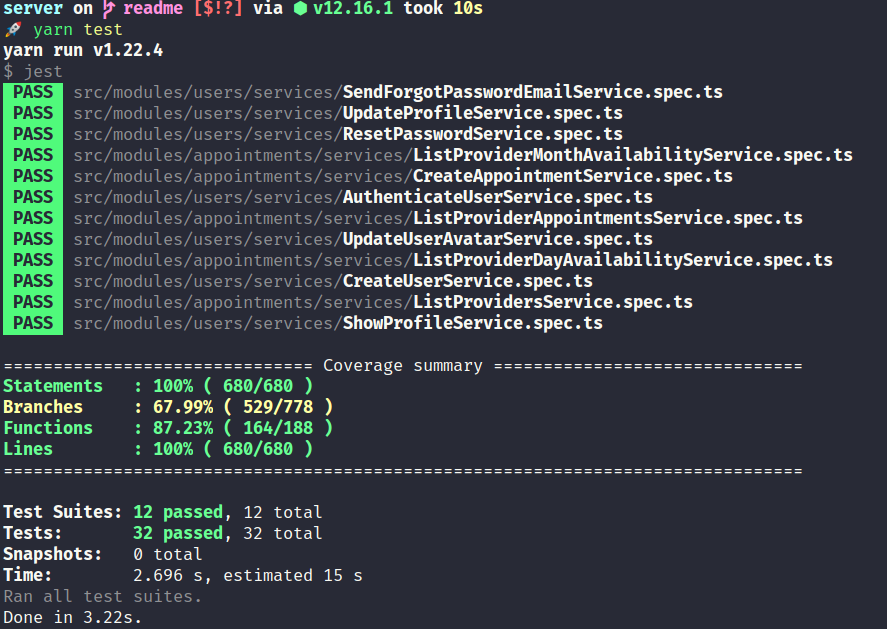

# Go Barber Server

<h1 align="center">
  
  
  
  
  
  
  
  
</h1>

## 🔮 Sobre o projeto

Aplicação desenvolvida para armazenar e servir os dados do GoBarber. Possui conexão com bancos de dados PostgreSQL, MongoDB e Redis.

## 📚 Tabela de Conteúdo

<!--ts-->
* [🔮 Sobre o projeto](#🔮-sobre-o-projeto)
* [📚 Tabela de Conteudo](#📚-tabela-de-conteúdo)
* [🛑 Pré-requisitos](#🛑-pré-requisitos)
  * [Docker](#docker)
  * [ORM COnfig](#ORMConfig)
* [🎲 Como rodar o projeto](#🎲-como-rodar-o-projeto)
* [🌎 Rotas da Aplicação](#🌎-rotas-da-aplicação)
* [📜 Features](#📜-features)
* [🛠 Tecnologias](#🛠-tecnologias)
* [🧪 Testes](#🧪-testes)
<!--te-->

## 🛑 Pré-requisitos

Antes de começar, você vai precisar ter instalado em sua máquina as seguintes ferramentas:
[Docker](https://docs.docker.com/engine/install/ubuntu/), [Git](https://git-scm.com), [Node.js](https://nodejs.org/en/)


### Docker

Após o **Docker** instalado, é necessário criar imagens dos bancos de dados que serão utilizados na aplicação. Pode copiar as linhas de comandos e colar no terminal para já instalar as imagens necessárias, ou seguir o passo a passa da documentação nos links.

[Documentação detalhada PostgreSQL](https://hub.docker.com/_/postgres) ou Instalação PostgreSQL:

```
# Imagem do PostgreSQL com nome "gobarber_postgres", rodando na porta 5432 e com senha "docker"
$ docker run --name gobarber_postgres -e POSTGRES_PASSWORD=docker -p 5432:5432 -d postgres
```
[Documentação detalhada Mongo](https://hub.docker.com/_/mongo) ou Instalação MongoDB:

```
# Imagem do Mongo com nome "gobarber_mongodb" rodando na porta 27017
$ docker run --name gobarber_mongodb -p 27017:27017 -d -t mongo
```

[Documentação detalhada Redis](https://hub.docker.com/_/redis) ou Instalação Redis:

```
# Imagem do Redis com nome "gobarber_redis" rodando na porta 6379
$ docker run --name gobarber_redis -p 6379:6379 -d -t redis:alpine
```

### ORMConfig

Deve-se criar o arquivo **ormconfig.json** e preenchê-lo com os dados de acordo com as imagens do docker criadas.

```json
[
  {
    "name": "default",
    "type": "postgres",
    "host": "localhost",
    "port": 5432,
    "username": "postgres",
    "password": "docker",
    "database": "gostack_gobarber",
    "entities": [
      "./src/modules/**/infra/typeorm/entities/*.ts"
    ],
    "migrations": [
      "./src/shared/infra/typeorm/migrations/*.ts"
    ],
    "cli": {
      "migrationsDir": "./src/shared/infra/typeorm/migrations"
    }
  },

  {
    "name": "mongo",
    "type": "mongodb",
    "host": "localhost",
    "port": 27017,
    "database": "gostack_gobarber",
    "useUnifiedTopology": true,
    "entities": [
      "./src/modules/**/infra/typeorm/schemas/*.ts"
    ]
  }

]
```

### .env

Necessário preencher os valores das variáveis ambientes. Obs: substituir o **localhost** do **APP_API_URL** pelo IP da máquina para que o mobile (Android) consiga se consiga se comunicar com a API.

```
# Application
APP_SECRET=
APP_WEB_URL=http://localhost:3000
APP_API_URL=http://localhost:3333


# Mail
MAIL_DRIVER=ethereal


# Amazon
AWS_ACESS_KEY_ID=
AWS_SECRET_ACESS_KEY_ID=


# Redis
REDIS_HOST=localhost
REDIS_PORT=6379
REDIS_PASS=

```

## 🎲 Como rodar o projeto

```bash
# Inicie os containers do docker
# Obs: utilize os nomes que usou ao criá-los
$ docker start gobarber_postgres gobarber_redis gobarber_mongodb

# Clone este repositório
$ git clone git@github.com:vitorsemidio-dev/gobarber-ts-server.git

# Acesse a pasta do projeto no terminal/cmd
$ cd gobarber-ts-server

# Instale as dependências
$ npm install

# Execute a aplicação em modo de desenvolvimento
$ npm run dev

# O servidor inciará na porta:3333 - acesse <http://localhost:3333>
```

## 🌎 Rotas da Aplicação

### appointments

`POST /appointments`

`GET /appointments/me`


### providers

`GET /providers`

`GET /providers/:provider_id/day-availability`

`GET /providers/:provider_id/month-availability`

### users

`POST /users`

`PATCH /users/avatar`

### sessions

`POST /sessions`

### password

`POST /password/reset`

`POST /password/forgot`

### profile

`PUT /profile`

`GET /profile`


## 📜 Features

- [x] Cadastro de usuários
- [x] Atualização do perfil do usuário
- [x] Atualização avatar do usuário logado
- [x] Criar agendamento em horários disponíveis
- [x] SignIn/SignOut
- [x] Listagem dos agendamentos do dia por data
- [x] Envio de e-mail


## 🛠 Tecnologias

- [Node.js](https://nodejs.org/en/)
- [TypeScript](https://www.typescriptlang.org/)
- [Jest](https://jestjs.io/)
- [TypeORM](https://typeorm.io/#/)
- [Celebrate](https://github.com/arb/celebrate)
- [Postgres](https://www.postgresql.org/)
- [Mongodb](https://www.mongodb.com/)
- [Redis](https://redis.io/)
- [Ethereal mail](https://ethereal.email/)
- [Multer](https://github.com/expressjs/multer)
- [Handlebars](https://handlebarsjs.com/)
- [Express](https://expressjs.com/)
- [Docker](https://www.docker.com/)
- [Rate Limiter Flexible](https://github.com/animir/node-rate-limiter-flexible)


## 🧪 Testes

<p align="center">
  
</p>
